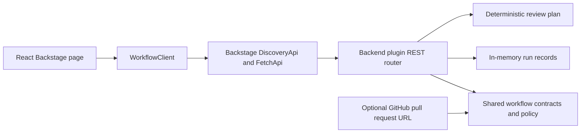

# Architecture

## Package boundaries

- `packages/ai-workflow-common` owns workflow types, the allowlist, credential-pattern checks, Backstage entity-reference validation and GitHub pull-request URL parsing.
- `plugins/ai-workflows` owns the React page, API client and Backstage `createPlugin` registration.
- `plugins/ai-workflows-backend` owns the REST router, run lifecycle, plan construction and Backstage `createBackendPlugin` registration.

## Security and AI boundary

The project deliberately does not call an LLM. It validates a non-sensitive request and returns the steps that an authorized provider integration would perform. This keeps local and CI execution deterministic while making the missing production boundary explicit.

- Workflows are allowlisted.
- Prompts have size limits and reject common credential/private-key formats.
- GitHub references must be HTTPS pull-request URLs on `github.com`.
- Test generation requires a human approval state.
- Runs never mutate source repositories or external systems.
- An enterprise implementation still needs identity, authorization, provider credentials, audit persistence, rate limits, cost controls and data-retention policy.

## Deployment assets

- The plugin modules are designed for installation into a Backstage monorepo.
- A standalone Express host exists only for API validation, container and deployment exercises.
- The Docker image runs as a non-root Node user and exposes a health check.
- The Helm chart uses non-root, read-only and dropped-capability settings.
- Azure Bicep describes a Container Apps environment with Log Analytics and health probing. It is not a record of an Azure deployment.
